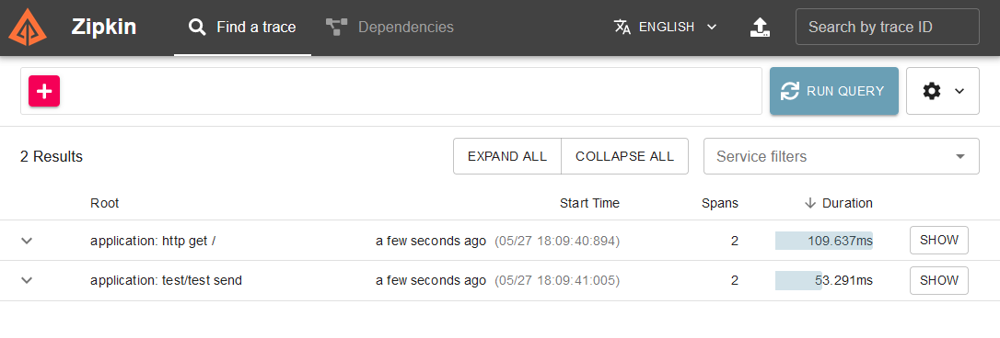
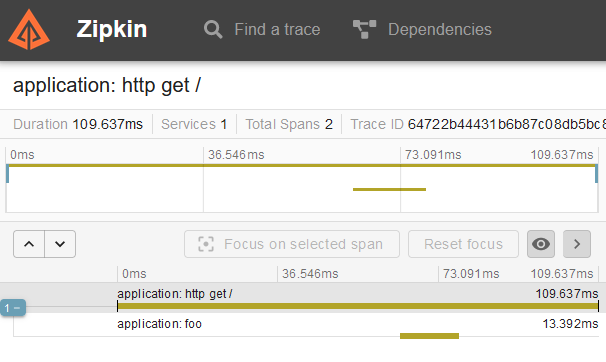
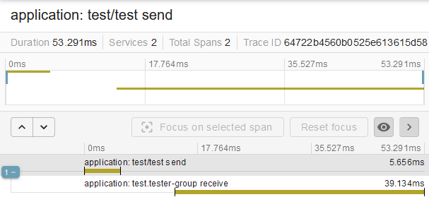

## Question
I configured a basic Spring Boot with Micrometer and Spring Stream (with RabbitMQ). I would like to configure that traceId can be passed into another service through Spring Stream. I would like to see only one trace in the Zipkin from the start service to the receiver service via rabbitmq.

How can it solve?

## PoC
### Start
1. Start dockers
```bash
$ docker run -p 15672:15672 -p 5672:5672 bitnami/rabbitmq

$ docker run -p 9411:9411 openzipkin/zipkin
```
2. Start project
3. Send request
```http request
GET http://localhost:8080/
```
### Result




